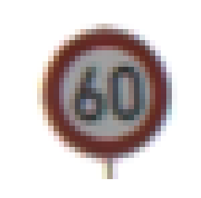
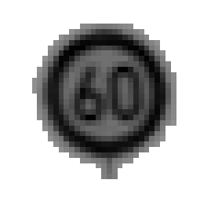

# German Traffic Sign Classification Using TensorFlow
---
**In this project, I used Python and TensorFlow to classify traffic signs.**

**Dataset used: [German Traffic Sign Dataset](http://benchmark.ini.rub.de/?section=gtsrb&subsection=dataset).
This dataset has more than 50,000 images of 43 classes.**

**I was able to reach a 98.7% validation accuracy, and a 97.1% testing accuracy.**

## Pipeline architecture:
---
- **Load The Data.**
- **Dataset Summary & Exploration**
- **Data Preprocessing**.
    - Shuffling.
    - Grayscaling.
    - Local Histogram Equalization.
    - Normalization.
- **Design a Model Architecture.**
    - LeNet-5.
- **Model Training and Evaluation.**
- **Testing the Model Using the Test Set.**
- **Testing the Model on New Images.**

## Step 1: Load The Data
---

Download the dataset from [here](https://s3-us-west-1.amazonaws.com/udacity-selfdrivingcar/traffic-signs-data.zip). This is a pickled dataset in which we've already resized the images to 32x32.

We already have three `.p` files of 32x32 resized images:
- `train.p`: The training set.
- `test.p`: The testing set.
- `valid.p`: The validation set.

We will use Python `pickle` to load the data.

---

## Step 2: Dataset Summary & Exploration

The pickled data is a dictionary with 4 key/value pairs:

- `'features'` is a 4D array containing raw pixel data of the traffic sign images, (num examples, width, height, channels).
- `'labels'` is a 1D array containing the label/class id of the traffic sign. The file `signnames.csv` contains id -> name mappings for each id.
- `'sizes'` is a list containing tuples, (width, height) representing the original width and height the image.
- `'coords'` is a list containing tuples, (x1, y1, x2, y2) representing coordinates of a bounding box around the sign in the image.

**First, we will use `numpy` provide the number of images in each subset, in addition to the image size, and the number of unique classes.**
Number of training examples:  34799
Number of testing examples:  12630
Number of validation examples:  4410
Image data shape = (32, 32, 3)
Number of classes = 43

**Then, we used `matplotlib` plot sample images .**


**And finally, we will use `numpy` to plot a histogram of the count of images in each unique class.**


#### Class Label distributed in both training and testing set

**Observations :**

* Data has strong imbalance among classes.
* Some are over represented and while other are less.
* Data distribution is almost same between training and test set.

---

## Step 3: Data Preprocessing

In this step, we will apply several preprocessing steps to the input images to achieve the best possible results.

**We will use the following preprocessing techniques:**
1. Shuffling.
2. Grayscaling.
3. Local Histogram Equalization.
4. Normalization.

* **Shuffling** - Shuffle help the training data to increase randomness and variety in training dataset, in order for the model to be more stable. We will use sklearn to shuffle our data
* **Grayscaling** - Opencv to convert RGB image 3 to grayscale 1 channel.It helps process efficiency , increase ConvNet's accuracy .. Reference: [Traffic Sign Recognition with Multi-Scale Convolutional Networks](http://yann.lecun.com/exdb/publis/pdf/sermanet-ijcnn-11.pdf) paper
* **EqualizeHist** - method used to adjust areas of lower local contrast to gain a higher contrast in images.It takes grayscale image as input. Function `cv2.equalizeHist(img)`
* **Normalize** - Normalization is a process that changes the range of pixel intensity values.This feature scaling is known to have beneficial effects on the gradient descent performed by the optimizer.

* **Orginal Image before preprocessing**:


* **Orginal Image after preprocessing**:


#### Data prepration :

* As our data is class imbalanced and best is to generate additional variety of data. 
* Using keras library, class: ImageDataGenerator - Process called data Augmentation
    - Training images are randomly shift (width)
    - Training images are randomly shift (height)
    - Training images zoomed
    - Training images rotated in narrow range.
* Augmented data is displayed below sample 15 

```

from keras.preprocessing.image import ImageDataGenerator
datagen = ImageDataGenerator(width_shift_range=0.1,
                            height_shift_range=0.1,
                            zoom_range=0.2,
                            shear_range=0.1,
                            rotation_range=15.)
datagen.fit(X_train_norm)
# for X_batch, y_batch in
 
batches = datagen.flow(X_train_norm, y_train, batch_size = 15)
X_batch, y_batch = next(batches)
 
fig, axs = plt.subplots(1, 15, figsize=(20, 5))
fig.tight_layout()
 
for i in range(15):
    axs[i].imshow(X_batch[i].reshape(32, 32),cmap="gray")
    axs[i].axis("off")
 
print(X_batch.shape)


```
**Sample Image** :


**Data Augmentation on sample Image**


---


## Step 3: Design a Model Architecture

In this step, we will design and implement a deep learning model that learns to recognize traffic signs from our dataset [German Traffic Sign Dataset](http://benchmark.ini.rub.de/?section=gtsrb&subsection=dataset).

We'll use Convolutional Neural Networks to classify the images in this dataset. The reason behind choosing ConvNets is that they are designed to recognize visual patterns directly from pixel images with minimal preprocessing. They automatically learn hierarchies of invariant features at every level from data.
We will implement two of the most famous ConvNets. Our goal is to reach an accuracy of +95% on the validation set.

I'll start by explaining each network architecture, then implement it using TensorFlow.


1. LeNet-5

LeNet-5 is a convolutional network designed for handwritten and machine-printed character recognition. It was introduced by the famous Yann LeCun in his paper Gradient-Based Learning Applied to Document Recognition in 1998. Although this ConvNet is intended to classify hand-written digits, we're confident it have a very high accuracy when dealing with traffic signs, given that both hand-written digits and traffic signs are given to the computer in the form of pixel images.

**LeNet-5 architecture:**

This ConvNet follows these steps: Adding few convolution layers

Input => Convolution => ReLU => Convolution => RelU => Pooling => Convolution => ReLU=> Convolution => ReLU  => Pooling =>Flatten => FullyConnected => ReLU =>dropout => FullyConnected => Relu => dropout => FullyConnected

Input => Shape 32x32x1

Layer 1 (Convolutional): The output shape should be 28x28x60.

Activation : Relu

Layer 2 (Convolutional): The output shape should be 24x24x60.

Activation : Relu

Pooling 1 : The output shape should be 12x12x60.

Layer 3 (Convolutional): The output shape should be 10x10x30.

Activation : Relu

Layer 4 (Convolutional): The output shape should be 8x8x30.

Activation : Relu

Pooling. The output shape should be 4x4x30.

Flattening: Flatten the output shape of the final pooling layer such that it's 1D instead of 3D input shape 480 (4x4x30).

Dense Layer 1 (Fully Connected): This should have 500 outputs.

Activation : Relu

Dropout layer 1

Dense Layer 2 (Fully Connected): This should have 100 outputs.

Activation : Relu

Dropout layer 2

Dense Layer 3 (Fully Connected): This should have 43 outputs.


Layer |	Shape
----- | -----
Input |	32x32x3
Convolution (valid, 5x5x60),Activation (RelU)|28x28x60
Convolution (valid, 5x5x60),Activation (RelU)|24X24X60
Max Pooling (valid, 2x2)|12x12x30
Convolution (valid, 3x3x60),Activation (RelU)|10x10x30
Convolution (valid, 3x3x60),Activation (RelU)|8X8X30
Max Pooling (valid, 2x2)|4x4x30
Flatten|480
Dense(Activation (ReLU)) |500
dropout|-
Dense(Activation(Relu))|100
dropout|-
Dense	|43
Activation (Softmax)|	43


**Notes**:
1. We specify the learning rate of 0.001, which tells the network how quickly to update the weights.
2. We minimize the loss function using the Adaptive Moment Estimation (Adam) Algorithm. Adam is an optimization algorithm introduced by D. Kingma and J. Lei Ba in a 2015 paper named [Adam: A Method for Stochastic Optimization](https://arxiv.org/abs/1412.6980). Adam algorithm computes adaptive learning rates for each parameter. In addition to storing an exponentially decaying average of past squared gradients like [Adadelta](https://arxiv.org/pdf/1212.5701.pdf) and [RMSprop](https://www.cs.toronto.edu/~tijmen/csc321/slides/lecture_slides_lec6.pdf) algorithms, Adam also keeps an exponentially decaying average of past gradients mtmt, similar to [momentum algorithm](http://www.sciencedirect.com/science/article/pii/S0893608098001166?via%3Dihub), which in turn produce better results.
3. we will run `minimize()` function on the optimizer which use backpropagation to update the network and minimize our training loss.


## Step 4: Model Training and Evaluation

In this step, we will train our model using `(X_train_norm)`, then we'll compute softmax cross entropy between `logits` and `labels` to measure the model's error probability.

The `keep_prob` variables will be used to control the dropout rate when training the neural network.
Overfitting is a serious problem in deep nural networks. Dropout is a technique for addressing this problem.
The key idea is to randomly drop units (along with their connections) from the neural network during training. This prevents units from co-adapting too much. During training, dropout samples from an exponential number of different “thinned” networks. At test time, it is easy to approximate the effect of averaging the predictions of all these thinned networks by simply using a single unthinned network that has smaller weights. This significantly reduces overfitting and gives major improvements over other regularization methods. This technique was introduced by N. Srivastava, G. Hinton, A. Krizhevsky I. Sutskever, and R. Salakhutdinov in their paper [Dropout: A Simple Way to Prevent Neural Networks from Overfitting](https://www.cs.toronto.edu/~hinton/absps/JMLRdropout.pdf).

Now, we'll run the training data through the training pipeline to train the model.
- Before each epoch, we'll shuffle the training set.
- After each epoch, we measure the loss and accuracy of the validation set.
- And after training, we will save the model.
- A low accuracy on the training and validation sets imply underfitting. A high accuracy on the training set but low accuracy on the validation set implies overfitting.

**Parameters**:
`
BATCHSIZE = 100
EPOCHS = 10
BATCHES_PER_EPOCH = 2000
learning rate = 0.001
drop1 layer keep prob = 0.3
drop2 layer keep prob = 0.5
`

### Model accuracy :

```
Training...
EPOCH 1 ...
Train Accuracy = 0.865 - Validation Accuracy: 0.839

EPOCH 2 ...
Train Accuracy = 0.954 - Validation Accuracy: 0.944

EPOCH 3 ...
Train Accuracy = 0.979 - Validation Accuracy: 0.970

EPOCH 4 ...
Train Accuracy = 0.985 - Validation Accuracy: 0.978

EPOCH 5 ...
Train Accuracy = 0.990 - Validation Accuracy: 0.979

EPOCH 6 ...
Train Accuracy = 0.991 - Validation Accuracy: 0.980

EPOCH 7 ...
Train Accuracy = 0.993 - Validation Accuracy: 0.980

EPOCH 8 ...
Train Accuracy = 0.994 - Validation Accuracy: 0.988

EPOCH 9 ...
Train Accuracy = 0.994 - Validation Accuracy: 0.988

EPOCH 10 ...
Train Accuracy = 0.996 - Validation Accuracy: 0.987

Model saved
```


#### Observations  Train set vs Validation set :

* Train Accuracy - 0.996
* Validation Accuracy - 0.987

The performance improved. The training accuracy is slightly higher than the validation accuracy. It might be a sign of overfitting but As the difference is negligible I m okey with it.


#### Observations  Train set vs Test set :

* **Test Accuracy - 0.97**

Model is performing better.

except few classes all other percentage accuracy greater than 90%

```                                  
6 End of speed limit (80km/h)                          88.00%  360

42 End of no passing by vehicles over 3.5 metric tons  86.67%  210

22 Bumpy road                                          82.50%  330

30 Beware of ice/snow                                  80.67%  390

27 Pedestrians                                         73.33%  210

```


### Test on New Images

**Load new Image**


**Result**

```
INFO:tensorflow:Restoring parameters from ./lenet
Image 0 - Target = 01, Predicted = 01
Image 1 - Target = 34, Predicted = 34
Image 2 - Target = 13, Predicted = 13
Image 3 - Target = 23, Predicted = 23
Image 4 - Target = 29, Predicted = 29
> Model accuracy: 1.00
```

Test Accuracy = 100.0%.
In all cases, the model was very certain (80% - 100%).

* **Conclusion:**
  - we've been able to reach a very high accuracy rate. We can observe that the models saturate after nearly 10 epochs, so we can save   - some computational resources and reduce the number of epochs to 10.
  - We can also try other preprocessing techniques to further improve the model's accuracy..
  - We can further improve on the model using hierarchical CNNs to first identify broader groups (like speed signs) and then have CNNs to classify finer features (such as the actual speed limit)
  
  
 File Location for reference:
* [html file code](./report.html) Project code saved as HTML file
* [Project Code](./Traffic_Sign_Classifier.ipynb)  Project code
* [Saved Images](./saved_images/)                  Screenshots
* [New Images](./New_test_images1/)                New images from web stored
* [Write_up file](./writeup_report.md)             Writeup file


